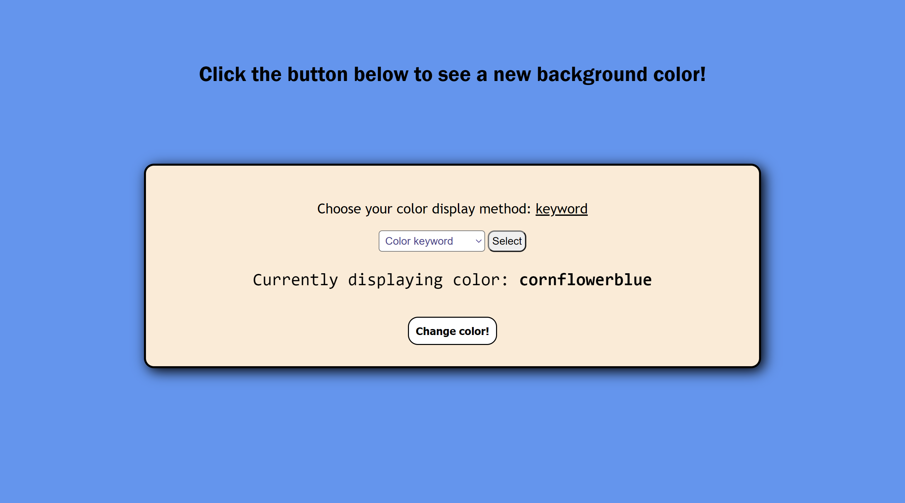
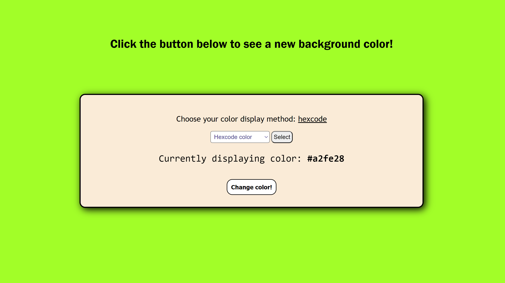

# Website Background Color Generator
This web page will generate random background colors in multiple HTML/CSS color formats.  

## Current Features
I decided not only to generate a random background color but also to allow the user to select which color method to use.  
At the moment, the user can select from any of the following methods:
- CSS color keywords (e.g. violet, burlywood, lightgray, etc.)
- Hexcode colors (e.g. #6a72c9)
- RGB colors (e.g. rgb(157, 69, 172))
- HSL colors (e.g. hsl(129, 48%, 72%))

## Skills in Focus
This project gave me the opportunity to practice various front-end skills across HTML, CSS, and JavaScript, including:
- DOM manipulation
- event listeners
- drop-down menus
- the use of preventDefault()
- CSS stylings (especially for the buttons)
- hover states
- multiple different color formats

## Roadmap
I considered adding a couple other features that in the end I chose to leave out, such as randomly generating gradient colors and allowing the user to type in their name which would then display in the central box as a greeting. In the future I may add such features. If you have suggestions for additional features (or code refactors), don't hesitate to contact me. 

## Acknowledgements :raised_hands:
The original inspiration for this learning project is Miguel Nunez's ["15 Beginner JavaScript Projects"](dev.to/codefoxx/15-beginner-javascript-projects-to-improve-your-front-end-skills-5bcj). Check out this link for other great project ideas.  
I also want to acknowledge my wife because she's awesome.

Never stop learning! Never stop coding!
